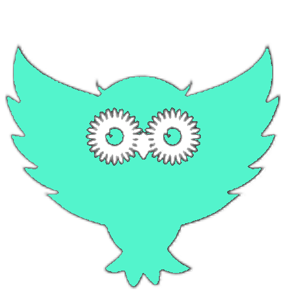
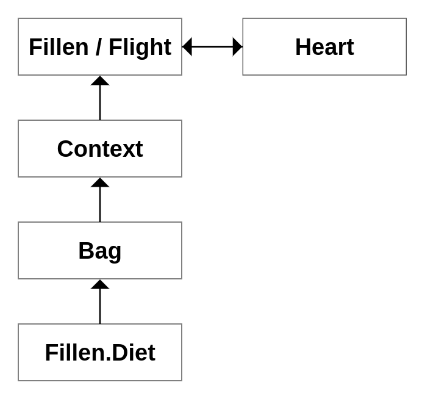
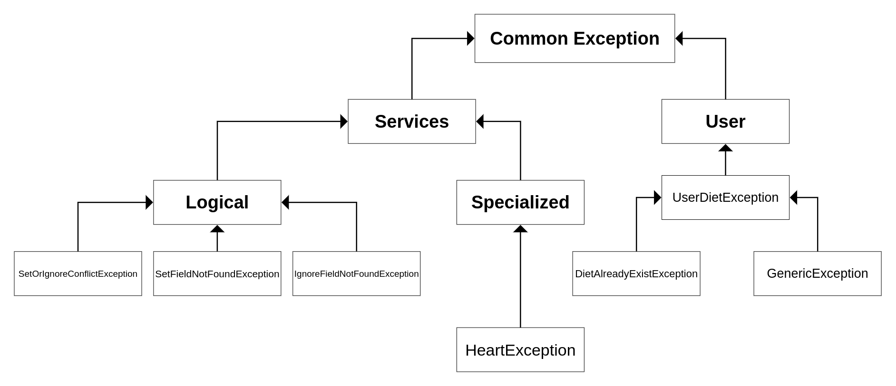
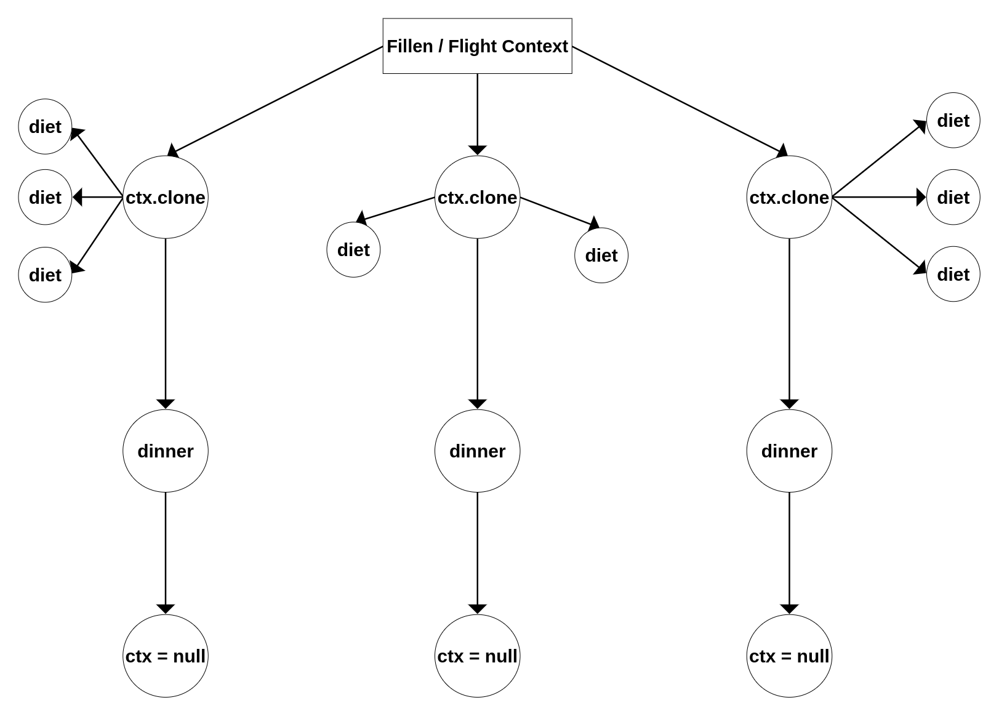

<div align="center">


<p style="font-size: 35px;"> Fillen</p>
<p style="margin-top: -25px;">small library for filling in class fields</p>
</div>

# Info
## About

The name Fillen is a play on the words Filler and Filin, it would be possible to add another letter 'l' to this name to get Filllen, but let's not chat on the post

Why do I need this library? The original purpose of this bible library was to fill in the fields of sufficiently complex classes for testing them at work, but now I can confidently say that these goals can be greatly expanded. For example, you can use this library for more convenient, simple and structured processing of classes and their fields, you can check fields for annotations, data types, access modifiers, generalized types, etc. This will probably allow you to create your own tools, which I am sure will help no generation of programmers yet ;)

Individual application examples can be viewed in the [tests](/src/test/java/com/github/shakal76/fillen/examples/Example.java)

## Build

```xml
<repositories>
    <repository>
       <id>jitpack.io</id>
       <url>https://jitpack.io</url>
    </repository>
</repositories>

<dependencies>
    <dependency>
          <groupId>com.github.shakal76</groupId>
          <artifactId>fillen</artifactId>
          <version>v1.0</version>
    </dependency>
<dependencies>
```

You can also build it through GitHub Package, [see](https://docs.github.com/en/packages/working-with-a-github-packages-registry/working-with-the-apache-maven-registry#installing-a-package)

## Licese
Apache License Version 2.0


# How it works?

  
Did you know how owls differ from filins?
I confess honestly and I didn't know the answer to this question myself until recently.
Both of these species belong to the order of owls. Unlike owls, filins are their biggest representatives. Filins are nocturnal predators. His diet is more varied.

## INTRODUCTION - Fillen Lifecycle

In reality, filins are born in a strong family, whose parents will be with them until they grow up to independent life. And even after that, the parents will not fly away forever, but will live in the same territory. 
Yes, filins are exemplary family men)

The path **our** filin begins with constructor that accept `diets`.

```java
import static com.github.shakal76.fillen.basic.api.base;

Fillen fillen = new Fillen(base);
```

### Meal
  
The filins is active mainly at night, in the first few hours after sunset and in the last few hours before sunrise.
Noticing a potential victim, the predator rushes at her with a stone and plunges its claws into her, snatched and dinners her

Unlike real filins, **ours** prefers different javabeans classes (default constructor, setters), which of course he will be able to see, otherwise he will either skip a piece of it (the class field) or ignore it (make it null).

```java
import static com.github.shakal76.fillen.basic.api.base;

Fillen fillen = new Fillen(base);
MyClass my = fillen.dinner(MyClass.class);
my.getSomeField();
        ...
```

**NOTICE** - if the field of your class is an array, list or others... and its final type is ignored, then the array itself will be initialized, but its first element will be null.

But why can Fillen not notice a 'piece of food'? - The thing is that he is limited by his diet)

### Heart

I think the most interesting feature of filins is their eyesight. 
They eyes are very large and look straight ahead, according to the position of the eye sockets on the front side of the facial parts of the skull, that is, an filin cannot move its eyes like a human. The eyes of filins stand motionless in place throughout their lives. The world appears to filins in black and white. Contrary to the popular belief that filins do not see anything during the day, the eyes of filins are not so sensitive to daylight; an filin, for example, sees perfectly during the day even at a great distance. With age, they change their color from light yellow to dark orange.

Fillen also has a heart that you can't see, but which sees you, and, moreover, you can customize it for yourself.
To do this, you just need to make a menu for our **filin**. Initially, the owl does not have any `diet`, but you can create it yourself or use the basic one.

Basic diet support types: **string, byte, short, int, long, float, double, boolean, char** - that the value of which will be random. And **array, list, set, queue and any implementation of Collection interface**.

To diversify his `diet` and thus adjust his vision, you can use the `abstract class Fillen.Diet`, where there is only one method not implemented - `Object menu(Object)`, 
where you can tell the Fillen how to process new data types. At the entrance, you will receive the ingredients class, which contains information about the field. To get the data type of the passed field, you can refer to it as `ingredients.type`. For the convenience of verification, you can use the built-in `isTypesEquals(one, two)` method. By implementing this class, you will get the corresponding object that should be placed in the `constructor` of our filin.

```java
Fillen.Diet diet = new Fillen.Diet() {
    @Override
    public Object menu(Ingredients ingredients) throw UserDietException {
        if (isTypesEquals(ingredients.type, BigDecimal.class)) {
            return new BigDecimal(123);
        }
        // ye, it's safety :)
        return null;
    }
};

Fillen fillen = new Fillen(diet);
        ...
```

Yes, in case you don't know what type of data the Fillen is transmitting to you, you can safely pass null
If an earlier handler defined the type, then your handler will not override its value.

In addition, you can redefine already existing `diets`. The override system works quite simply.
If you have created several `diets` and they have been dropped into the `bag`, then the last diet from it will have priority.

### Bag

If you have created too many `diets` and you need to hand them over to the Fillen in a nice way, then Bag can help you with this.

```java
Bag bag = new Bag();
bag.add(firstDiet);
bag.add(otherDiet);

Fillen fillen = new Fillen(bag);
```
**NOTICE** - bag can't have more than one type of diet

Also, if you want to get or remove a `diet` by its type - try this:

```java
Bag bag = new Bag();
bag.add(firstDiet);
bag.add(otherDiet);

bag.get(otherDiet.getClass());
bag.remove(otherDiet.getClass());
        
Fillen fillen = new Fillen(bag);
```


### Briefly about Ingredients

This class provides you with information about the field passed to your handler (diet). It consists of:

- Class<?> type

- String name

- Generic generic

- Annotation[] declaredAnnotations

- int modifier

But its important feature is that all these fields are immutable, even though there are setters in this class, they will not change the current object, but create a new one based on an existing one with the value you changed. 

What should I do if I need to add processing of an internal type whose fields also need to be processed, in which case we have a method available only inside `Fillen.Diet` - `dinner`, just pass it the appropriate type

### About Container types

At the moment, only Set, Queue, List, Array and implementations of Collection (ArrayList, LinkedList...) are implemented. Their logic is simple, they create a container from as many measures as were specified and only add the value/values of the target type at the end. Yes, I didn't misspoke - values are also possible. You can pass a `FillenList` of values with normal handlers and they will be passed to the field, if the type was not a container, then only the first cell of your result will be passed, otherwise it will pass all the values.

You can also create such logical handlers - you can see more information about this [here](/src/main/java/com/github/shakal76/fillen/basic/api.java)

_______________

Phew, well, let's get some rest

### To be simpler

Sometimes in life we need to think. Often we like to complicate a lot for no apparent reason. And that's why sometimes we should stop and think.

In many cases, we can simplify our lives if we use one small but very useful method - `fillen.set(String fieldName, Object value)`

```java
MyClass my = fillen.set("myFieldName", 123)
                       .dinner(MyClass.class);
        ...
```

**NOTICE** - it will be performed on top of all `diets`.


And sometimes we just need to relax and relax.

Filins sleep an average of 10-12 hours a day. They try to choose a place to spend the night away from interference and often high up in the branches of trees.

To give our Fillen a little rest, we need to use the `ignore(String... fieldNames)` method.
and it is best to do this during the flight:

```java
Flight flight = fillen.ignore("firstFieldName", "otherFieldName");
Example example = flight.dinner(Example.class);
        ...
```

Why do we need to 'fly'? - This property can be extremely useful, as we separate our `diets` from our 'simplifications', which leads to greater mobility of use.

In addition, if you `ignore` the field, then the presence of a setter is optional

If you use the same fields for `set` and `ignore` it will inevitably lead to a conflict - `SetOrIgnoreConflictException`
_______________

### Time


But time goes by, days pass and one day we will have to leave. No matter how difficult it is to accept, but our filin ends up in the `Converter` class.

```java
new Converter().bind("a", "b")
        .fromto(myObject, Example.class);

```

**NOT IMPLEMENTED YET**

_______________

## MEDIUM - DIET

### Design recommendations

First, try to separate `Fillen.Diet` classes by meaning. 
Secondly, when you have a lot of `diets` and you need to combine them, create a class with a **static public field** of your `api`, inside which you can use the built-in connector method. Here is an example of such an `api`:

```java
public final class api {
    public static final Fillen.Diet base = new Fillen.Diet() {
        @Override
        public Object menu(Ingredients ingredients) throws UserDietException {
            return connector(ingredients, new RandomDiet(), new CollectionDiet(), new ArrayDiet());
        }
    };
}
```

### Recursion

Quite often we need to work with nested types, so for example recursion is used to create containers (arrays, lists...). For these purposes, we have a `seeback` method that will re-call ALL the diets that you have invested in Fillen

```java
public Object menu(Ingredients ingredients) throws UserDietException{
    if(getAllInterfaces(ingredients.type).contains(Collection.class)){
        Collection result=collectionGenerate(ingredients.type);
        Generic newGeneric=ingredients.generic.next();
        Object callback=seeback(
            ingredients.setType(ingredients.generic.get().get(0))
                .setGeneric(newGeneric)
        );
        if(callback.getClass().isAssignableFrom(FillenList.class)){
            result.addAll(((FillenList)callback).getList());
        }else{
            result.add(callback);
        }
        return result;
    }
    return null;
}
```

All collection implementations are processed here. But in addition to `seeback` method, there are a few more interesting points here. The first is a `Generic` object, with which you can handle generic types. It supports two models - **procedural** (do you just take `List<Class<?>>` through the `get` method and process) | for arrays use ingredients.type.getComponentType and **recursive** (the next method simply removes the first cell from the internal list)

The second very important thing that I ask you to pay attention to is the `FillenList` type. If you use this type in the class that you will process, the `dinner` method will return an exception to you. This type is needed just for processing in containers. Any `diet` can create this list if it has several candidates for the result. If such a list is not processed in another handler, then Fillen will take only the **first** element from it.

So yes, you can return something similar in your `diets`:

```java
@Override
public Object menu(Ingredients ingredients) throws UserDietException {
    if (isTypesEquals(ingredients.type, String.class)) {
        List<String> list = new ArrayList<>();
        list.add("FIRST");
        list.add("SECOND");
        
        FillenList wrapper = new FillenList();
        wrapper.setList(list);
    }    
}
```

### Dinner callback with the existing context

Imagine a situation, your class contains a type field of your other class. In addition, you often use `ignore`, `set` and other methods. I.e. you need a way to call `dinner` with a contest that is currently loaded into your `diet`. Don't worry, we have a built-in dinner method in `Fillen.Diet` for this:

```java
@Override
public Object menu(Ingredients ingredients) throws UserDietException{
    if(isTypesEquals(ingredients.type, OtherPojo.class)) {
        return dinner(ingredients.type);
        // or so: return dinner(OtherPojo.class);
    }
}
```

### Exception

Well, the last thing I want to say here is exception handling - you can manipulate or create subtypes of `UserDietException`.

## ADVANCED - ARCHITECTURE

### Fillen


### Exception


### Context


# TODO:

- add threading tests
- add class converter?
- fix restedChecker
- fix Bag comparablity for Diets
- add to Bag method swap
- add debug into Bag or Heart

Filins color - #53F4CC
